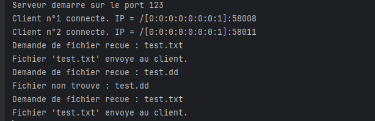
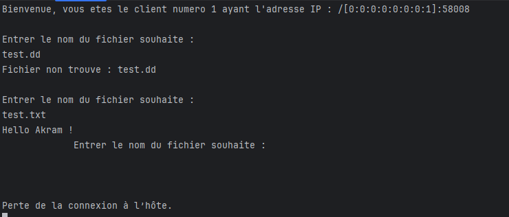
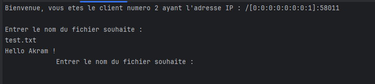

# TP-8-POO : Programmation Réseau en Java

Ce projet contient deux exercices démontrant l'utilisation des sockets en Java pour la programmation réseau.

## Exercice 1 : Jeu de devinettes

L'exercice 1 implémente un jeu de devinettes simple entre un client et un serveur.

### Structure des fichiers

#### Client.java
```java
public class Client {
    public static void main(String[] args) {
        Socket socket = null;
        Scanner sc = new Scanner(System.in);

        try {
            socket = new Socket("localhost", 123);
        } catch (IOException e) {
            System.out.println("Error: " + e.getMessage());
        }
    }
}
```

Le client :
- Se connecte au serveur sur le port 123
- Permet à l'utilisateur d'entrer des nombres
- Reçoit et affiche les réponses du serveur
- Continue jusqu'à ce que le bon nombre soit trouvé

#### Server.java
```java
public class Server {
    public static void main(String[] args) {
        try {
            serverSocket = new ServerSocket(123);
            int nombre = (int) (Math.random() * 100);
        } catch (IOException e) {
            System.err.println("Error: " + e.getMessage());
        }
    }
}
```

Le serveur :
- Écoute sur le port 123
- Génère un nombre aléatoire entre 0 et 100
- Guide le client avec des messages "plus grand" ou "plus petit"
- Annonce la victoire quand le nombre est trouvé

## Exercice 2 : Serveur de Fichiers

L'exercice 2 implémente un serveur de fichiers simple permettant aux clients de demander des fichiers.

## Implementation de ServeursFiles.java

#### ServeursFiles.java
```java
import java.io.*;
import java.net.ServerSocket;
import java.net.Socket;
import java.nio.file.Files;
import java.nio.file.Path;
import java.nio.file.Paths;

public class ServeursFiles extends Thread {
    private static final String FILE_DIRECTORY = "C:\\Users\\HP\\OneDrive\\Bureau\\test\\TP-8-POO\\EXO2\\src\\main\\java\\Files";
    private int nbrClient = 0;

    public static void main(String[] args) {
        new ServeursFiles().start();
    }

    @Override
    public void run() {
        try (ServerSocket ss = new ServerSocket(123)) {
            System.out.println("Serveur démarré sur le port " + ss.getLocalPort());
            while (true) {
                Socket socket = ss.accept();
                nbrClient++;
                new Communication(socket, nbrClient).start();
            }
        } catch (IOException e) {
            throw new RuntimeException(e);
        }
    }

    class Communication extends Thread {
        private Socket socket;
        private int numClient;

        public Communication(Socket socket, int numClient) {
            this.socket = socket;
            this.numClient = numClient;
        }

        @Override
        public void run() {
            try (InputStream inputStream = socket.getInputStream();
                 InputStreamReader inputStreamReader = new InputStreamReader(inputStream);
                 BufferedReader bufferedReader = new BufferedReader(inputStreamReader);
                 OutputStream outputStream = socket.getOutputStream();
                 PrintWriter printWriter = new PrintWriter(outputStream, true)) {

                System.out.println("Client n°" + numClient + " connecté. IP = " + socket.getRemoteSocketAddress());
                printWriter.println("Bienvenue, vous êtes le client numéro " + numClient + " ayant l'adresse IP : " + socket.getRemoteSocketAddress());

                while (true) {
                    printWriter.println("Entrer le nom du fichier souhaité : ");
                    String fileName = bufferedReader.readLine();
                    if (fileName == null || fileName.isEmpty()) {
                        break;
                    }
                    System.out.println("Demande de fichier reçue : " + fileName);

                    Path filePath = Paths.get(FILE_DIRECTORY, fileName);
                    File file = filePath.toFile();

                    if (file.exists() && file.isFile()) {
                        byte[] fileContent = Files.readAllBytes(filePath);
                        outputStream.write(fileContent);
                        outputStream.flush();
                        System.out.println("Fichier '" + fileName + "' envoyé au client.");
                    } else {
                        String errorMessage = "Fichier non trouvé : " + fileName;
                        printWriter.println(errorMessage);
                        System.out.println(errorMessage);
                    }
                }

            } catch (IOException e) {
                System.err.println("Erreur de communication avec le client n°" + numClient + ": " + e.getMessage());
            } finally {
                try {
                    socket.close();
                } catch (IOException e) {
                    System.err.println("Erreur lors de la fermeture du socket pour le client n°" + numClient + ": " + e.getMessage());
                }
            }
        }
    }
}

```

## Exemple d'utilisation
### serveur

### client 1

### client 2

### Déclarations :

- FILE_DIRECTORY : Répertoire contenant les fichiers à servir.
- nbrClient : Compteur pour suivre le nombre de clients connectés.

### Méthode main :

Démarre le serveur en créant une instance de ServeursFiles et en appelant sa méthode start().

### Méthode run :

- Crée un ServerSocket écoutant sur le port 123.
- Affiche un message indiquant que le serveur a démarré.
- Boucle infinie pour accepter les connexions clients.
- Pour chaque connexion, incrémente nbrClient.
- Crée et démarre un thread Communication pour gérer la connexion avec le client.

## Comment exécuter les exercices

### Exercice 1
1. Démarrer le serveur en exécutant `Server.java`
2. Démarrer le client en exécutant `Client.java`
3. Suivre les instructions pour deviner le nombre

### Exercice 2
1. Démarrer le serveur en exécutant `ServeursFiles.java`
2. Démarrer un client 1 en exécutant `telnet localhost 123`
3. Démarrer un client 2 en exécutant `telnet localhost 123`.....
4. Entrer le nom du fichier souhaité par un client x.

## Technologies utilisées
- Java
- Sockets TCP/IP
- Threads (pour l'exercice 2)
- Entrées/Sorties (I/O) Java
